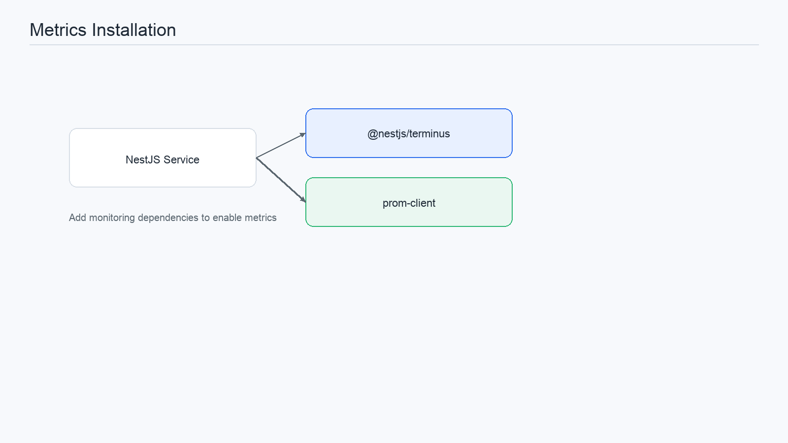
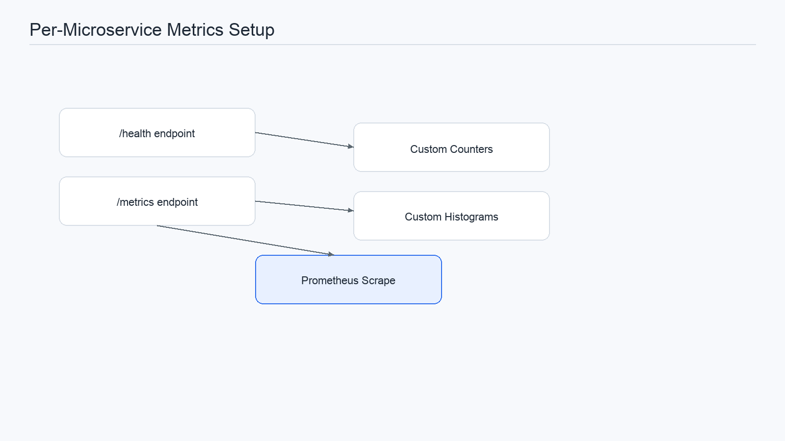
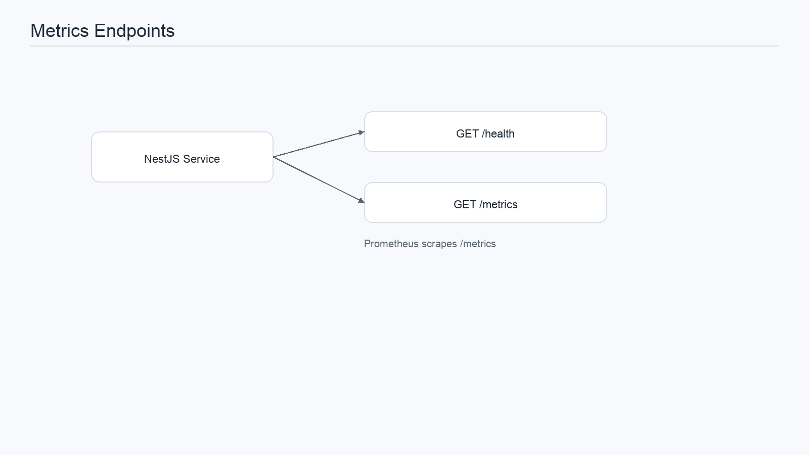
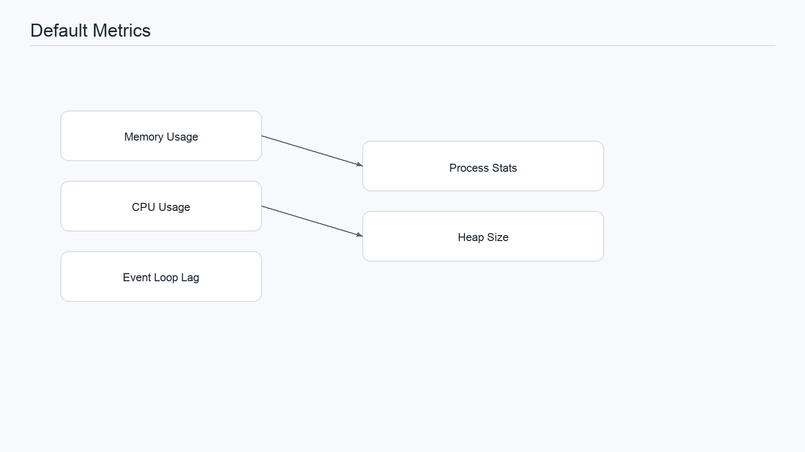
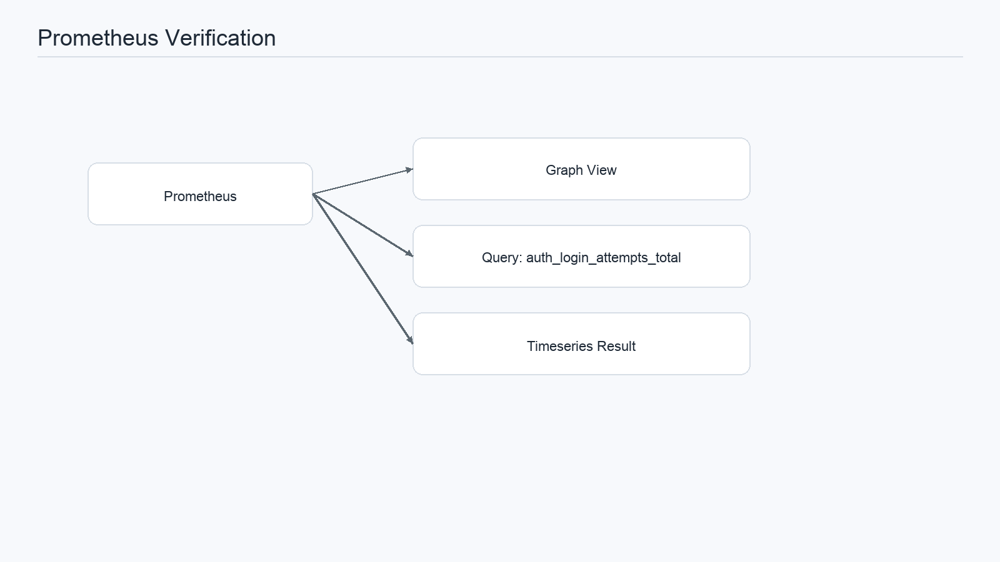
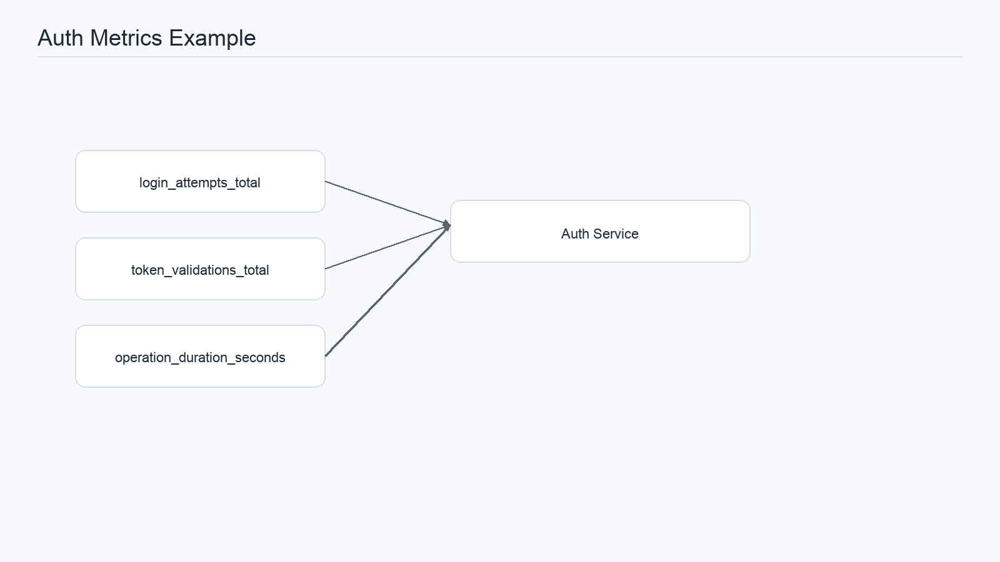
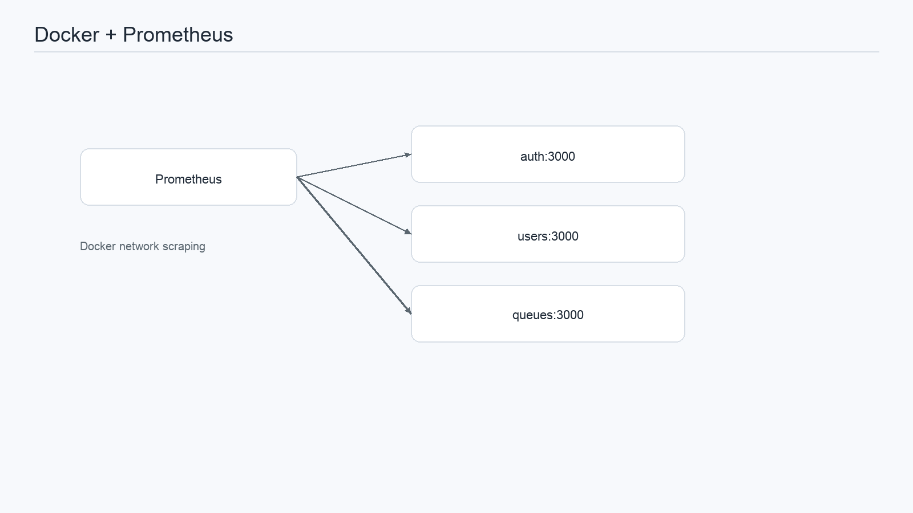
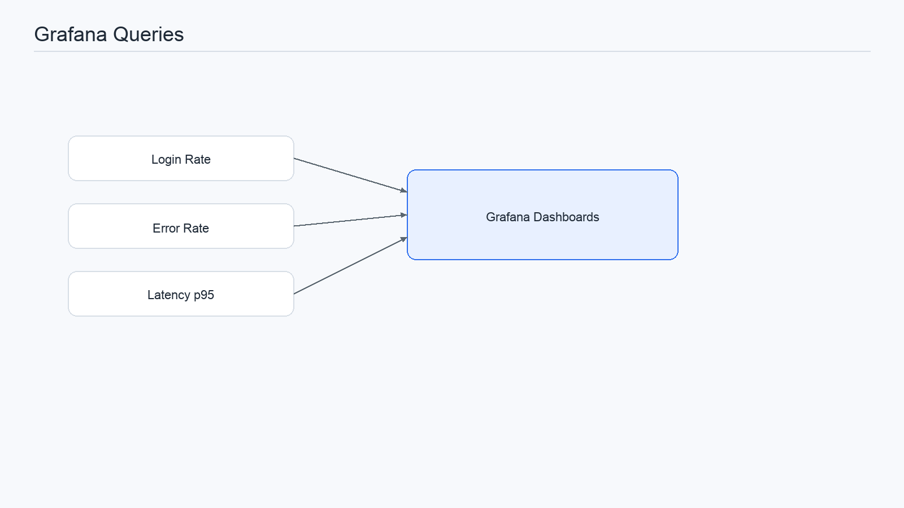
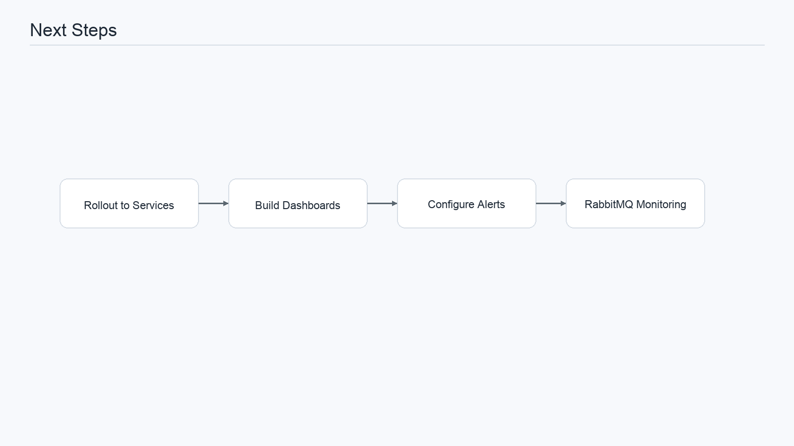
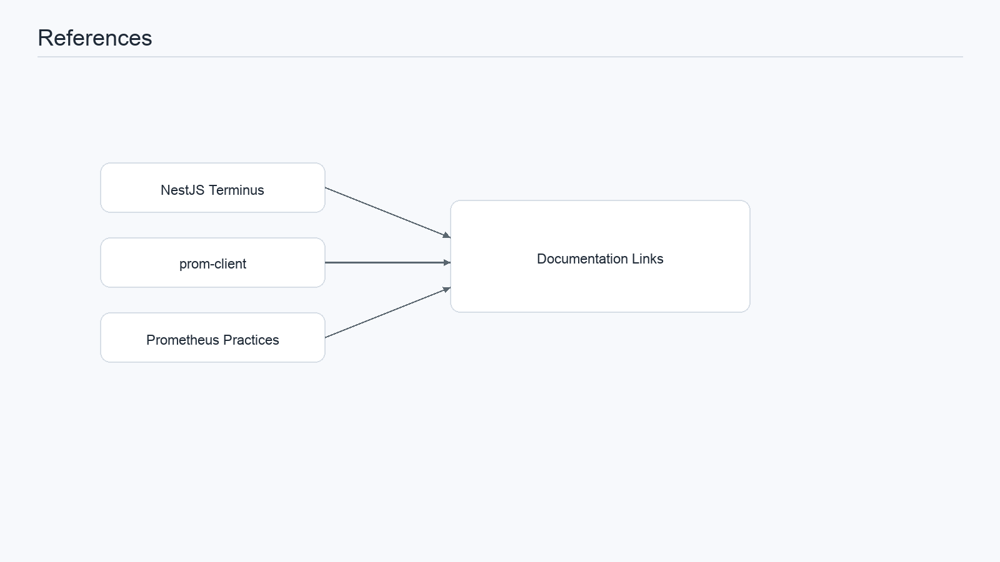

# Prometheus Metrics Setup for NestJS

Guide to configure your NestJS microservices to expose Prometheus metrics.

## Required Installation

To let Prometheus scrape metrics from your microservices, install the monitoring packages:

```bash
npm install @nestjs/terminus prom-client
```



## Per-Microservice Setup

### 1. Create a Healthcheck Module (recommended)

Create a file in each microservice, for example `src/health/health.controller.ts`:

```typescript
import { Controller, Get } from '@nestjs/common';
import { HealthCheck, HealthCheckService, HttpHealthIndicator } from '@nestjs/terminus';

@Controller('health')
export class HealthController {
  constructor(
    private health: HealthCheckService,
    private http: HttpHealthIndicator,
  ) {}

  @Get()
  @HealthCheck()
  check() {
    return this.health.check([
      () => this.http.pingCheck('nestjs', 'http://localhost:3000'),
    ]);
  }
}
```

### 2. Add a Metrics Endpoint

Create `src/metrics/metrics.controller.ts`:

```typescript
import { Controller, Get, Res } from '@nestjs/common';
import { Response } from 'express';
import * as client from 'prom-client';

@Controller('metrics')
export class MetricsController {
  @Get()
  async getMetrics(@Res() res: Response) {
    res.set('Content-Type', client.register.contentType);
    res.end(await client.register.metrics());
  }
}
```

### 3. Import in the Root Module

In `src/auth.module.ts` (or your microservice module):

```typescript
import { Module } from '@nestjs/common';
import { TerminusModule } from '@nestjs/terminus';
import { HealthController } from './health/health.controller';
import { MetricsController } from './metrics/metrics.controller';
import { AuthController } from './auth.controller';
import { AuthService } from './auth.service';

@Module({
  imports: [TerminusModule],
  controllers: [AuthController, HealthController, MetricsController],
  providers: [AuthService],
})
export class AuthModule {}
```

### 4. Collect Custom Metrics

In your service, you can define custom metrics:

```typescript
import { Injectable } from '@nestjs/common';
import * as client from 'prom-client';

@Injectable()
export class AuthService {
  private readonly loginCounter = new client.Counter({
    name: 'auth_login_attempts_total',
    help: 'Total number of login attempts',
    labelNames: ['status'],
  });

  private readonly loginDuration = new client.Histogram({
    name: 'auth_login_duration_seconds',
    help: 'Duration of login operations in seconds',
    buckets: [0.1, 0.5, 1, 2, 5],
  });

  async login(credentials: any) {
    const startTime = Date.now();

    try {
      // Your login logic
      this.loginCounter.inc({ status: 'success' });
      return result;
    } catch (error) {
      this.loginCounter.inc({ status: 'failure' });
      throw error;
    } finally {
      const duration = (Date.now() - startTime) / 1000;
      this.loginDuration.observe(duration);
    }
  }
}
```



## Available Endpoints

Once configured, the following endpoints are available:

- `/health` - Health check
- `/metrics` - Prometheus metrics

Examples:

```bash
# Check health
curl http://localhost:3000/health

# Get metrics
curl http://localhost:3000/metrics
```



## Default Metrics

With `prom-client`, you get the following by default:

- `node_memory_heap_used_bytes` - Heap memory used
- `node_memory_heap_size_bytes` - Total heap size
- `process_cpu_seconds_total` - Total CPU time
- `process_resident_memory_bytes` - Resident memory
- `nodejs_eventloop_lag_seconds` - Event loop lag



## Verification

To verify Prometheus is scraping metrics:

1. Open http://localhost:9090 (Prometheus)
2. Go to "Graph"
3. Search for: `auth_login_attempts_total`
4. You should see metrics from your service



## Full Example: Auth Service

```typescript
import { Injectable } from '@nestjs/common';
import * as client from 'prom-client';

@Injectable()
export class AuthService {
  private loginAttempts = new client.Counter({
    name: 'auth_login_attempts_total',
    help: 'Total login attempts',
    labelNames: ['result'],
  });

  private tokenValidations = new client.Counter({
    name: 'auth_token_validations_total',
    help: 'Total token validations',
    labelNames: ['valid'],
  });

  private operationDuration = new client.Histogram({
    name: 'auth_operation_duration_seconds',
    help: 'Operation duration in seconds',
    labelNames: ['operation'],
  });

  async validateUser(email: string, password: string) {
    const timer = this.operationDuration.startTimer({ operation: 'validate' });

    try {
      // Validation logic
      const user = await this.usersService.findOne(email);

      if (!user) {
        this.loginAttempts.inc({ result: 'user_not_found' });
        timer();
        throw new UnauthorizedException();
      }

      if (!await compare(password, user.password)) {
        this.loginAttempts.inc({ result: 'invalid_password' });
        timer();
        throw new UnauthorizedException();
      }

      this.loginAttempts.inc({ result: 'success' });
      timer();
      return user;
    } catch (error) {
      this.loginAttempts.inc({ result: 'error' });
      timer();
      throw error;
    }
  }

  async validateToken(token: string) {
    try {
      const validated = await this.jwtService.verify(token);
      this.tokenValidations.inc({ valid: 'true' });
      return validated;
    } catch {
      this.tokenValidations.inc({ valid: 'false' });
      throw new UnauthorizedException();
    }
  }
}
```



## Docker Integration

Containers are already configured in Prometheus for automatic scraping:

```yaml
# From observability/prometheus/prometheus.yml
- job_name: 'auth'
  static_configs:
    - targets: ['auth:3000']
  scrape_interval: 15s
  metrics_path: '/metrics'
```



## Useful Grafana Queries

```promql
# Login attempts rate
rate(auth_login_attempts_total[5m])

# Validation average latency
histogram_quantile(0.95, rate(auth_operation_duration_seconds_bucket[5m]))

# Total errors
rate(auth_login_attempts_total{result=~"error|failure"}[5m])
```



## Next Steps

1. Implement this in all microservices
2. Create Grafana dashboards to visualize metrics
3. Configure alerts based on metric thresholds
4. Monitor RabbitMQ with [rabbitmq-exporter](https://github.com/kbudde/rabbitmq_exporter)



## References

- [NestJS Terminus Documentation](https://docs.nestjs.com/recipes/terminus)
- [prom-client Documentation](https://github.com/siimon/prom-client)
- [Prometheus Metrics Best Practices](https://prometheus.io/docs/practices/naming/)


