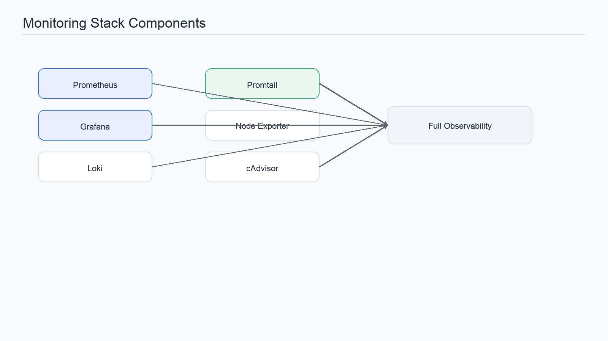
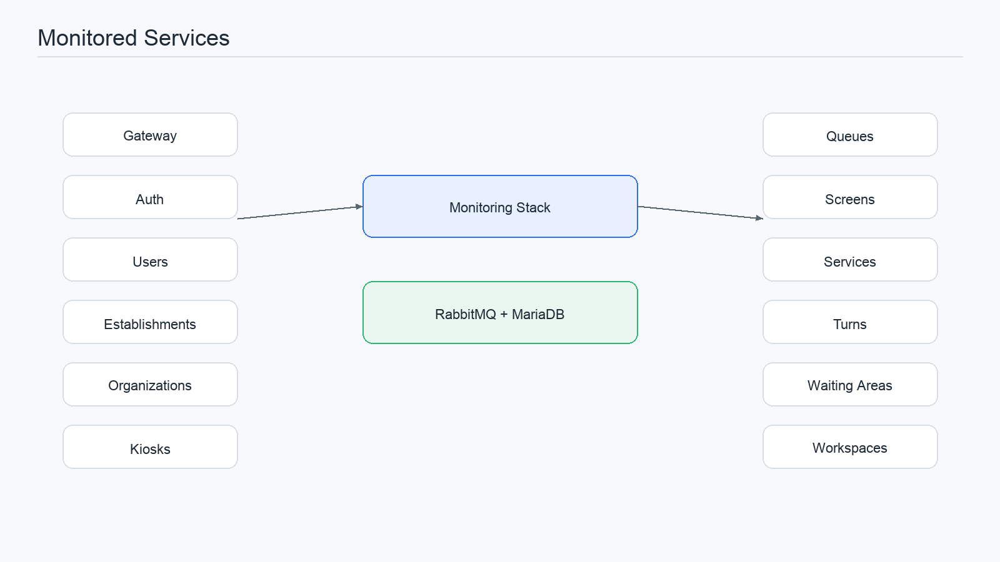
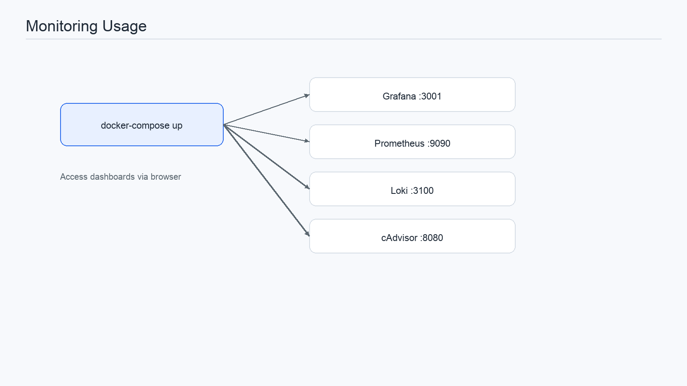
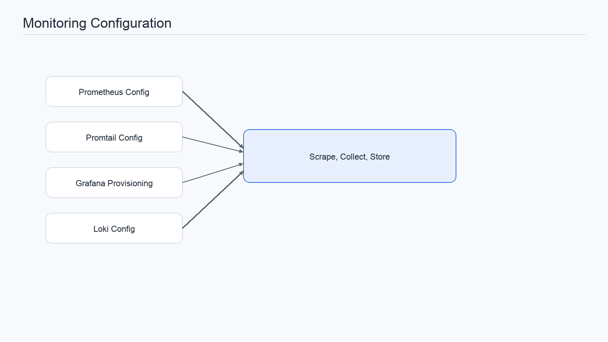
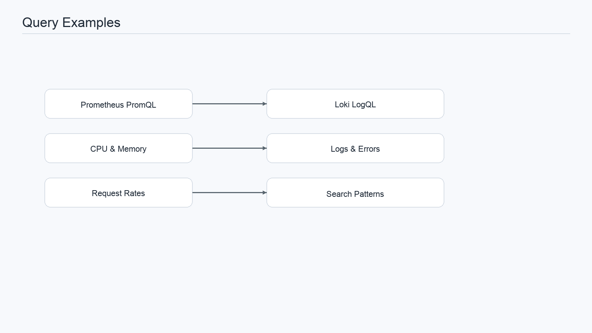
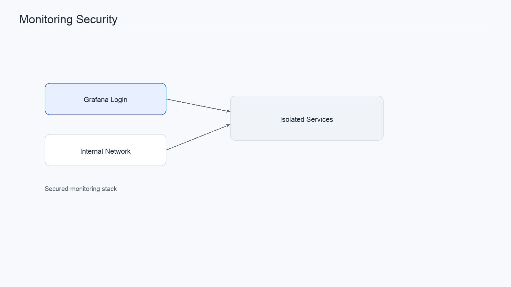
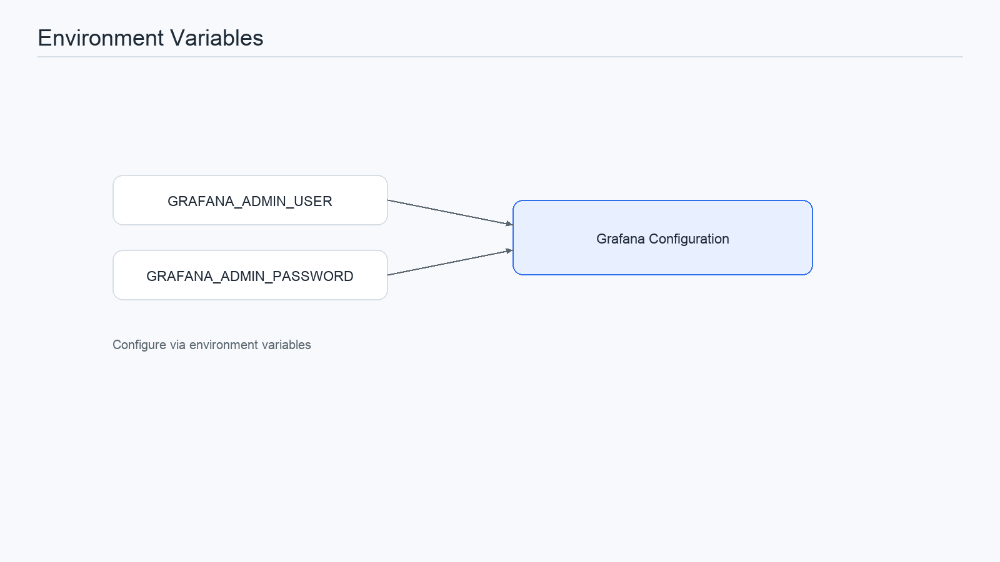
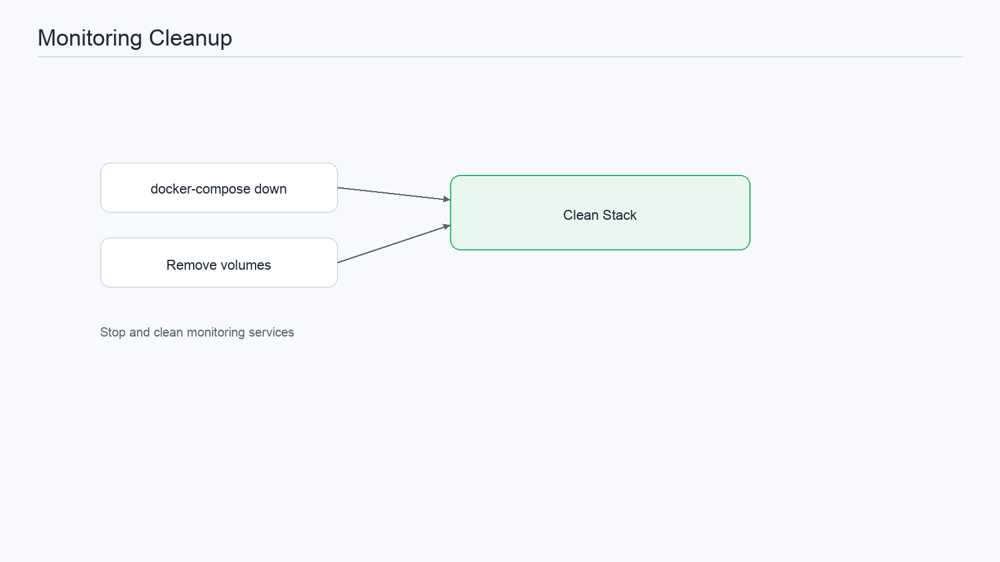
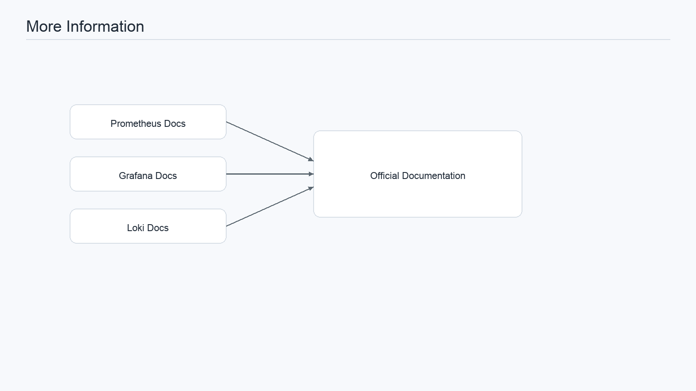

# Monitoring Stack

Monitoring system with Prometheus, Grafana, Loki, and Promtail for full observability of the microservices.

## Components

### Prometheus (Port 9090)

- Metrics collection for all services
- TSDB storage with 30-day retention
- Automatic scrape every 15 seconds

### Grafana (Port 3001)

- Dashboards and metrics visualization
- Alerting and notifications
- Username: `admin` | Password: `admin123`

### Loki (Port 3100)

- Log aggregation
- Real-time log queries and search

### Promtail (Port 9080)

- Log collection agent
- Automatically collects logs from containers tagged with `logging=promtail`

### Node Exporter (Port 9100)

- System metrics (CPU, memory, disk)

### cAdvisor (Port 8080)

- Docker container metrics
- Per-container resource analysis



## Monitored Services

All these microservices are pre-configured for monitoring:

- **Gateway** - API Gateway (3000)
- **Auth** - Authentication service
- **Users** - User management
- **Establishments** - Establishment management
- **Organizations** - Organization management
- **Kiosks** - Kiosk management
- **Queues** - Queue management
- **Screens** - Screen management
- **Services** - Service management
- **Turns** - Turn management
- **Waiting-Areas** - Waiting area management
- **Workspaces** - Workspace management
- **Notifications** - Notification service
- **RabbitMQ** - Message broker
- **MariaDB** - Database



## Usage

### With docker-compose-local.yml

```bash
docker-compose -f docker-compose-local.yml up -d
```

This starts all monitoring services along with RabbitMQ and MariaDB.

### Dashboard Access

| Component | URL | Credentials |
|-----------|-----|-------------|
| Grafana | http://localhost:3001 | admin / admin123 |
| Prometheus | http://localhost:9090 | - |
| Loki | http://localhost:3100 | - |
| cAdvisor | http://localhost:8080 | - |



## Configuration

### Prometheus

See [observability/prometheus/prometheus.yml](observability/prometheus/prometheus.yml) to:

- Add new services to monitor
- Change scrape intervals
- Configure alerts

### Promtail

See [observability/promtail/promtail-config.yml](observability/promtail/promtail-config.yml) to:

- Configure log sources
- Add processing pipelines
- Configure labels

### Grafana

See [observability/grafana/provisioning](observability/grafana/provisioning) to:

- Provision data sources automatically
- Pre-load dashboards
- Configure alerts

### Loki

See [observability/loki/loki-config.yml](observability/loki/loki-config.yml) to:

- Storage configuration
- Log retention
- Query limits



## Useful Queries

### Prometheus

```promql
# CPU per service
avg(rate(container_cpu_usage_seconds_total[5m])) by (pod_name)

# Memory usage
container_memory_usage_bytes / 1024 / 1024

# Requests per second in Gateway
rate(http_requests_total[1m])
```

### LogQL (Loki)

```
# Gateway logs
{service="gateway"}

# Errors
{level="error"}

# Logs from a specific container
{container_name="gateway-app"}
```



## Security

- Grafana is protected with user/password
- Change the default password via `GRAFANA_ADMIN_PASSWORD`
- Internal endpoints are not exposed to the internet



## Environment Variables

```bash
GRAFANA_ADMIN_USER=admin
GRAFANA_ADMIN_PASSWORD=admin123
```



## Cleanup

To stop and remove monitoring containers:

```bash
docker-compose -f docker-compose-local.yml down
docker volume rm prometheus-data grafana-data loki-data
```



## More Information

- [Prometheus Docs](https://prometheus.io/docs/)
- [Grafana Docs](https://grafana.com/docs/)
- [Loki Docs](https://grafana.com/docs/loki/)
- [Promtail Docs](https://grafana.com/docs/loki/latest/send-data/promtail/)


